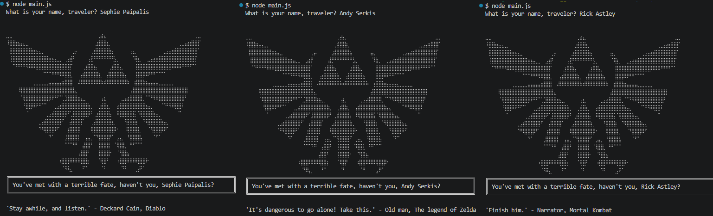

## Laboration 1 – Fortsätt programmera

Ett enkelt Node.js-program som frågar efter användarens namn och visar ett nördigt välkomstmeddelande tillsammans med ett slumpmässigt valt spelcitat.

## Klona repot:

git clone <https://github.com/SephiePaipalis/1DV610_Lab1>

## Kör programmet:

node main.js

## Funktioner
Frågar användaren efter namn.
Visar ett ASCII-motiv och ett personligt meddelande.
Väljer ett slumpmässigt citat från quotes.js.
Skriver ut citatet i terminalen.

## Exempel:

